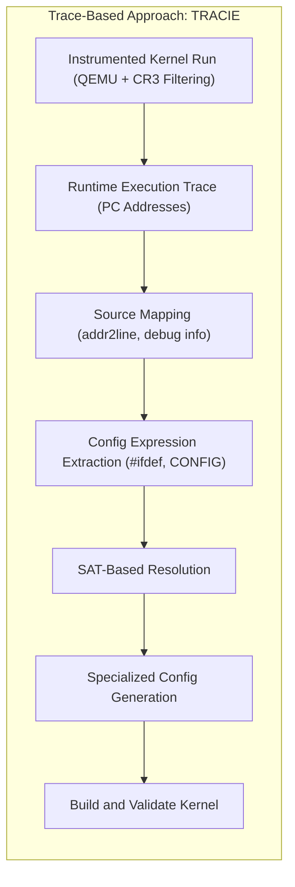
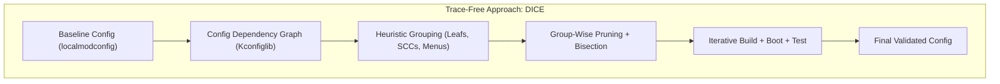

# Artifacts: "In Pursuit of Lean OS Kernels: Improving Configuration-Based Debloating"

This repo contains all the code artifacts for the paper "In Pursuit of Lean OS Kernels: Improving Configuration-Based Debloating" presented at ACSAC 2025.

## Infrastructure Requirements

Docker + Docker Compose

## Overview

```txt
artifacts/
├── linux/                  # Linux kernel source and build environment
│   ├── source              # Linux kernel source (v5.15)
│   └── builder             # Scripts to build and test the kernel
│
├── tracie/                 # Trace-based approach: Tracie
│   ├── qemu.patch          # Patch for QEMU to support Tracie's tracing mechanism
│   ├── cr3-kmod/           # Kernel module to log CR3 values for filtering user-space noise
│   ├── kconfig_db.py       # Script to build the config.db database
│   ├── config.db           # Database mapping config options to source files and line numbers
│   ├── trace2config.py     # Script to map execution traces to kernel config options
│   └── config-solver.py    # Script to compute a minimal kernel config using a SAT solver
│
├── dice/                   # Trace-free approach: Dice
│   └── dice.py             # Script that iteratively prunes the kernel config tree/graph
│
├── Makefile                # Makefile to automate builds and tests
├── LICENSE                 # License file
└── readme.md               # This file
```


## System 1: Tracie



### Trace Artifact Overview

Code:

- [qemu.patch](./artifact/tracie/qemu.patch): Patch for QEMU to support Tracie's tracing mechanism (PC + CR3).
- [cr3-kmod](./artifact/tracie/cr3-kmod/): Kernel module to log CR3 values for filtering user-space noise from workload kernel traces.
- [kconfig_db.py](./artifact/tracie/kconfig_db.py): Script to build the [config.db](./artifact/tracie/config.db) database from the Linux kernel source which maps config options to source files and line numbers.
- [trace2config.py](./artifact/tracie/trace2config.py): Script to map execution traces to kernel configuration options.
- [config_solver.py](./artifact/tracie/config_solver.py): Script to compute a minimal kernel configuration based on traced options using a SAT solver.

Data:

- [config.db](./artifact/tracie/config.db): Database mapping kernel configuration options to source files and line numbers.

## System 2: Dice



### Dice Artifact Overview

Code:

- [config_pruner.py](./artifact/dice/config_pruner.py): Script that iteratively prunes the kernel configuration tree/graph to remove unused options.
